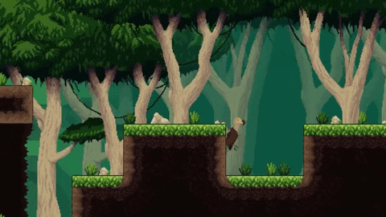

# Karsten Finlay
[Profile](#profile)| [Projects](#projects) | [Software Skills](#software-skills) | [Skills](#Skills) | [Education](#Education)

## [Profile](#Profile):

Graduate of Makers, junior full stack developer and enthusiastic learner. Constantly learning and applying my skills to new projects.

Ever since the start of my journey at Makers Academy I have worked very well in groups, usually taking a more managerial like role. My use of agile tools and skills made it easy to work in large groups. I am a good communicator while also being flexible so that I can generate a solid team dynamic.

Avid video game player and game designer. I have created multiple video games in game jams and just for fun.

## [Projects](#projects)

| Name                         | Description | link  | Tech/tools        |
| ---------------------------- | ----------------- | ----------------- | ------------------- |
| **Dodo Alone**               | A platforming video game about a dodo trying to escape her extinction. | https://www.youtube.com/watch?v=OE4eqvqEwUo | Unity, C#. |
| **Godzilla Tries His Best** | A minigame style video game about Godzilla fixing Japan. | https://globalgamejam.org/2020/games/godzilla-tries-his-best-8 | Unity, C#  |
| **Spring Onion** | Carbon offsetting app, created to help reduce the amount of carbon emissions given off by cars. | https://github.com/KarstenFinlay/SmellsLikeGreenSpirit | React-native, Expo Go, JavaScript, Jest, CSS |
| **SpaceBook** | A FaceBook clone, a CRUD application. | https://github.com/KarstenFinlay/acebook-sholk | Ruby on Rails, Ruby, Javascript, CSS, HTML, Active Record |
| **Air-PhP** | An air bnb clone, testing out the uses of databases. | https://github.com/KarstenFinlay/Air-PhP | Sinatra, Ruby, SQL, CSS, HTML  |

## [Software Skills](#software-skills)

* Languages:
	1. Ruby
	2. JavaScript
	3. HTML
	4. CSS
	5. C#
	6. C++

* Frameworks:
	1. Rails
	2. Sinatra
	3. React-native
	4. Xcode

* Testing-Frameworks:
	1. Rspec
	2. Jasmine
	3. Jest
	4. Capybara

* CI/CD tools:
	1. Travis

* Great understanding of Github and Git
* Test driven development
* Vast knowledge on Agile processes
* Understanding of object oriented programming 

## [Skills](#Skills)

### Resilience

One of my strengths is that I can bounce back from situations of adversity and stress. This attribute has had a profound effect on my personal growth and has helped me to learn from difficult situations.

### Inventive

While studying at Makers and attending the Bristol Global Game Jam 2020, I realised that I am an inventive person. In both situations I was able to come up with good ideas or suitable solutions to problems that were encountered. Whether in regard to creativity or problem-solving I have been able to find inventive and efficient ways forward.

### Leadership

While studying at Makers and attending the Bristol Global Game Jam 2020, I realised that I am an inventive person. In both situations I was able to come up with good ideas or suitable solutions to problems that were encountered. Whether in regard to creativity or problem-solving I have been able to find inventive and efficient ways forward.

### Teamwork

Working in groups is a strength of mine. In the most recent project, Spring Onion, a part of the team were having difficulties with a git merge - there were too many conflicting files – so we had a call where I explained how to fix the problem, enabling them to proceed and not lose time. Outside of official group work, I had three mentees to guide and I often answered queries posted to our Slack channel.

#### Other

I have completed the Duke of Edinburgh Gold award. In terms of language, I am an intermediate German user and a Japanese language beginner.

## Work experience:

Waiter at St George's House Trust, Windsor, Windsor Castle (Sep 2019 - May 2020)

My experience as a waiter in St George’s House Conference Centre within Windsor Castle enabled me to strengthen my communication and team-building skills. This job also gave me an opportunity to work with people from diverse members of society. This position required careful listening and a willingness to work hard behind the scenes.

Designer/Developer at Astral Dawn Studios LTD (May 2020 - Sep 2020)

While working as a designer at Astral Dawn Studios I developed a passion for coding. While there I designed characters, levels and mechanics for Dodo Alone, a 2D pixel platformer. I got to grips with agile processes, sprints, stand ups and retros. Github was used throughout the whole process, so I got used to version control, difficult merges and rebases. Clear communication via good commits was essential. I now also understand the work flow in the tech industry.

*Gameplay of Dodo Alone*

 

## [Education](#Education)

#### Bradfield college GCSE (2014 - 2016)
---

#### Bradfield college A levels (2016 - 2018)
- Maths
- Physics
- Economics

#### Makers Academy (Nov2020 to Present - Mar2021)

12 week intensive coding bootcamp.

A very heavy focus on test driven development with an emphasis on pair programming and working with various agile tools such as Trello, object oriented programming, learn languages in good coding convention, taught to be an independent learner and problem-solver. Experience with MVC framework patterns.

## Hobbies

- Video games

- Travelling 

- A bit of a film buff, cinematography really appeals to me.

- Board games, mostly co-op ones.

- Playing squash.
